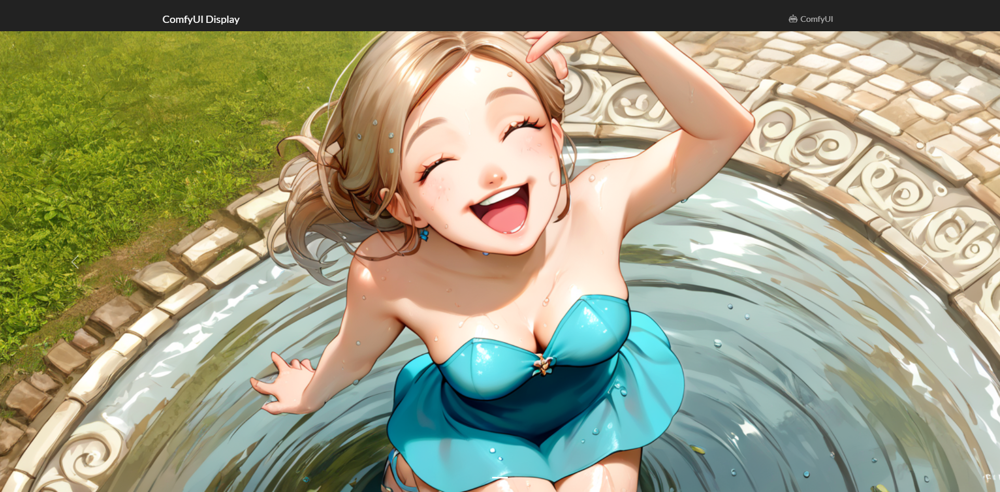

# Comfy-Display

A simple monitoring app that polls image from a [ComfyUI](https://github.com/comfyanonymous/ComfyUI) instance and displays the output images from the latest workflow.

## Usage

Run the application and browse to the web page. The application should handle all the rest.

Docker image is also available at [Docker Hub](https://hub.docker.com/repository/docker/wutipong/comfy-display/general)

## Configuration

By default, Comfy-Display pulls images from `http://127.0.0.1:8188` which is the default URL of ComfyUI. The request will be sent with no extra fields.

### PUBLIC_COMFY_URL

 To change the ComfyUI's address, set the environment `PUBLIC_COMFY_URL` to the address.

### PUBLIC_COMFY_HEADERS

Some instance of ComfyUI needs special HTTP headers fieds when it's setup in a specific way, eg. running behind CloudFlare Zero Access (like mine). If this is the case for your instance, set the `PUBLIC_COMFY_HEADERS` environment variable to a JSON containing a map of key-value pairs of said request.

For example, if ComfyUI requires 2 fields on the REST API's HTTP request as following:

| Field                   | Value                                                            |
| ----------------------- | ---------------------------------------------------------------- |
| CF-Access-Client-Id     | d41d8cd98f00b204e9800998ecf8427e.access                          |
| CF-Access-Client-Secret | e3b0c44298fc1c149afbf4c8996fb92427ae41e4649b934ca495991b7852b855 |

Assign the `PUBLIC_COMFY_HEADERS` variable to `
{"CF-Access-Client-Id": "d41d8cd98f00b204e9800998ecf8427e.access", "CF-Access-Client-Secret": "e3b0c44298fc1c149afbf4c8996fb92427ae41e4649b934ca495991b7852b855"}`.
